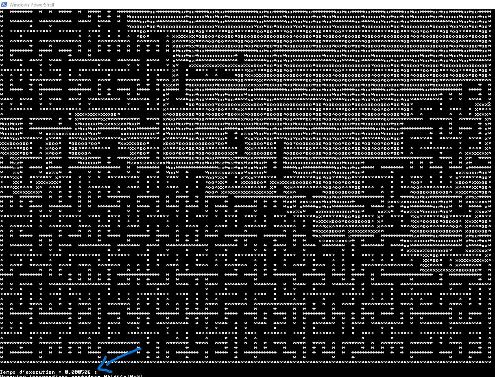

# C Maze Solver 
## _✨Efficiency is the key✨_

[](https://github.com/) [](https://https://docker.com/) [](https://github.com/Naereen/badges/) ![Love](https://img.shields.io/badge/Love-pink?style=flat-square&logo=data:image/svg%2bxml;base64,PHN2ZyByb2xlPSJpbWciIHZpZXdCb3g9IjAgMCAyNCAyNCIgeG1sbnM9Imh0dHA6Ly93d3cudzMub3JnLzIwMDAvc3ZnIj48dGl0bGU+R2l0SHViIFNwb25zb3JzIGljb248L3RpdGxlPjxwYXRoIGQ9Ik0xNy42MjUgMS40OTljLTIuMzIgMC00LjM1NCAxLjIwMy01LjYyNSAzLjAzLTEuMjcxLTEuODI3LTMuMzA1LTMuMDMtNS42MjUtMy4wM0MzLjEyOSAxLjQ5OSAwIDQuMjUzIDAgOC4yNDljMCA0LjI3NSAzLjA2OCA3Ljg0NyA1LjgyOCAxMC4yMjdhMzMuMTQgMzMuMTQgMCAwIDAgNS42MTYgMy44NzZsLjAyOC4wMTcuMDA4LjAwMy0uMDAxLjAwM2MuMTYzLjA4NS4zNDIuMTI2LjUyMS4xMjUuMTc5LjAwMS4zNTgtLjA0MS41MjEtLjEyNWwtLjAwMS0uMDAzLjAwOC0uMDAzLjAyOC0uMDE3YTMzLjE0IDMzLjE0IDAgMCAwIDUuNjE2LTMuODc2QzIwLjkzMiAxNi4wOTYgMjQgMTIuNTI0IDI0IDguMjQ5YzAtMy45OTYtMy4xMjktNi43NS02LjM3NS02Ljc1em0tLjkxOSAxNS4yNzVhMzAuNzY2IDMwLjc2NiAwIDAgMS00LjcwMyAzLjMxNmwtLjAwNC0uMDAyLS4wMDQuMDAyYTMwLjk1NSAzMC45NTUgMCAwIDEtNC43MDMtMy4zMTZjLTIuNjc3LTIuMzA3LTUuMDQ3LTUuMjk4LTUuMDQ3LTguNTIzIDAtMi43NTQgMi4xMjEtNC41IDQuMTI1LTQuNSAyLjA2IDAgMy45MTQgMS40NzkgNC41NDQgMy42ODQuMTQzLjQ5NS41OTYuNzk3IDEuMDg2Ljc5Ni40OS4wMDEuOTQzLS4zMDIgMS4wODUtLjc5Ni42My0yLjIwNSAyLjQ4NC0zLjY4NCA0LjU0NC0zLjY4NCAyLjAwNCAwIDQuMTI1IDEuNzQ2IDQuMTI1IDQuNSAwIDMuMjI1LTIuMzcgNi4yMTYtNS4wNDggOC41MjN6Ii8+PC9zdmc+)  [](http://ForTheBadge.com)

This maze solver is a C version of a DFS algorithm with in mind the tiniest execution time. JS/HTML version at the bottom of this README.

 

## Features

- Can solve any maze with corresponding characters as the examples
- Lightweight and compatible with every computer thanks to docker
- A child could use it, obviously


> The purpose of this was a school project / challenge


## Installation

Simply clone the repo and then you have three options : 

### Docker
```sh
docker-compose up --build
```
To test the examples given in this repo, edit this line in the Dockerfile : 
```sh
RUN ./maze ./code/r5.txt
```

### Compile
Compile dfs.c using gcc with : 
```sh
gcc -o OutputFileName ./code/dfs.c
```
Then run the program with : 
```sh
./OutputFileName [mazeFilename.extension]
```

### [Try an online JS / HTML version](http://152.228.139.203/Game/mazeSolver/index.html)
 [Repo here](https://github.com/SimonBredeche/MazeSolverHTML)
